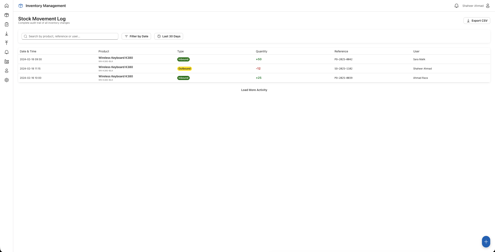
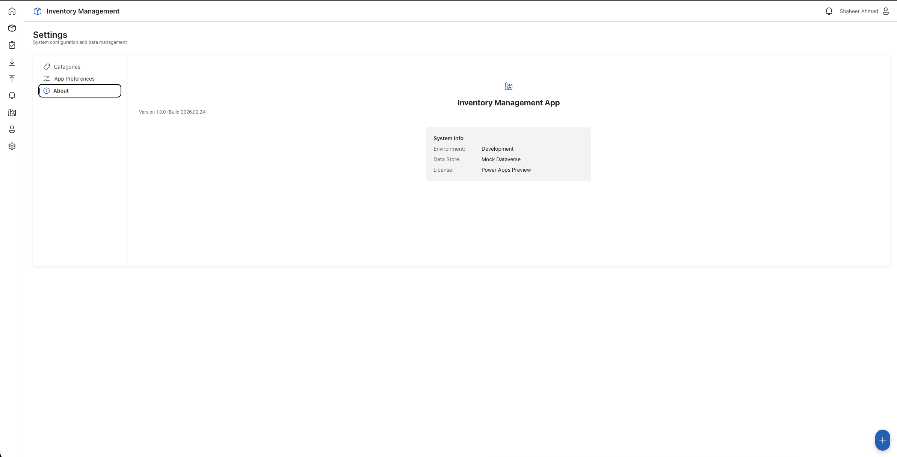

# Inventory Management - Open Source Sample

A professional, high-end inventory management system built for the Power Apps ecosystem. This project serves as a comprehensive sample for building complex, responsive CRM and ERP-style applications using React, TypeScript, and Microsoft's Fluent UI design system.


## 🚀 Overview

This application provides a robust suite of tools for managing products, tracking stock levels, and monitoring warehouse operations. It is pre-configured to work seamlessly as a **Power Apps Code App**, allowing developers to build complex custom interfaces that run directly within the Power Platform.

## 📦 Download Solutions

Get the latest version of the Inventory Management solution for Power Apps:

- **[📥 Download Unmanaged Solution](./Solutions/InventoryManagement_1_0_0_1.zip)** (Recommended for developers)
- **[📦 Download Managed Solution](./Solutions/InventoryManagement_1_0_0_2_managed.zip)** (Recommended for production)

## ✨ Key Features

- **📊 Modern Dashboard**: Real-time overview of inventory statistics, low-stock alerts, and recent activities.
- **🔄 Stock Management**:
  - **Receive Stock**: Streamlined workflow for logging incoming shipments.
  - **Issue Stock**: Efficient process for tracking outgoing inventory.
  - **Stock Log**: Detailed audit trail of all inventory movements.
  
- **🏭 Location Manager**: Manage warehouse sections and storage locations.
  
- **🤝 Supplier Management**: Track supplier information and associated product statistics.
- **⚙️ Advanced Settings**: Customizable system configurations.
  

## 🛠️ Tech Stack

- **Framework**: [React 19](https://react.dev/)
- **Build Tool**: [Vite](https://vite.dev/)
- **Language**: [TypeScript](https://www.typescriptlang.org/)
- **UI System**: [Fluent UI React v9](https://react.fluentui.dev/)
- **Icons**: [Fluent UI System Icons](https://github.com/microsoft/fluentui-system-icons)
- **Platform**: [Power Apps Code Apps](https://learn.microsoft.com/en-us/power-apps/developer/component-framework/overview)

## 🏁 Getting Started

### Prerequisites

- [Node.js](https://nodejs.org/) (Latest LTS recommended)
- [npm](https://www.npmjs.com/) or [yarn](https://yarnpkg.com/)

### Installation

1. Clone the repository:
   ```bash
   git clone https://github.com/shaheerahmadch/InventoryManagement.git
   cd InventoryManagement
   ```

2. Install dependencies:
   ```bash
   npm install
   ```

### Development

Start the development server:
```bash
npm run dev
```

### Build

Create a production build:
```bash
npm run build
```

## 📂 Project Structure

```text
src/
├── components/ # Reusable UI components
├── data/       # Mock data and data management
├── screens/    # Main application views (Dashboard, Products, etc.)
├── styles/     # Theme definitions and global styles
└── App.tsx     # Main application entry and navigation
```

## 🔌 Power Apps Integration

This project is optimized for use with the **Power Apps Component Framework (PCF)**. It includes `@microsoft/power-apps` and `@microsoft/power-apps-vite` to ensure compatibility and streamlined deployment to the Power Platform.

## 📄 License

This project is open-source and available under the [MIT License](LICENSE).

---
*Built with ❤️ by [Shaheer Ahmad](https://github.com/shaheerahmadch)*
